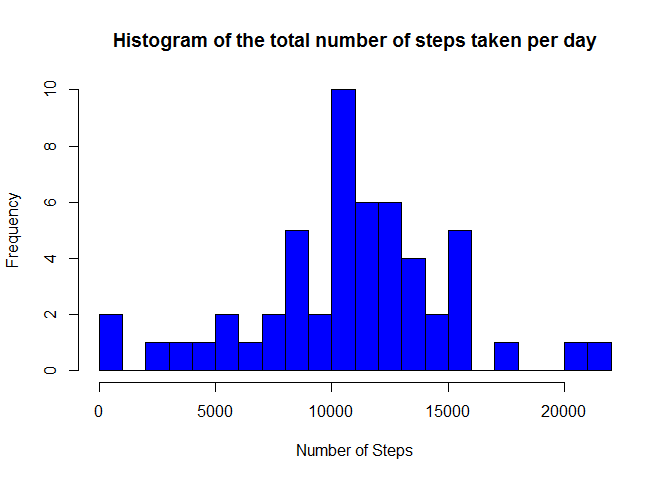
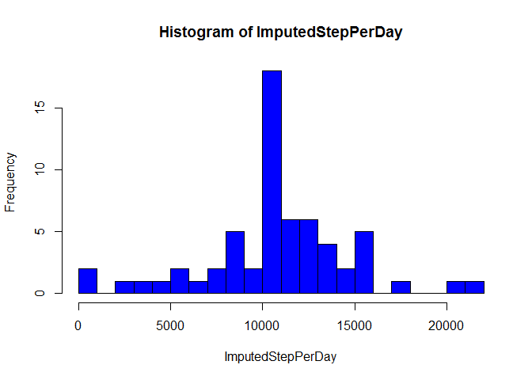

# Reproducible Research: Peer Assessment 1

##Introduction

It is now possible to collect a large amount of data about personal movement using activity monitoring devices such as a Fitbit, Nike Fuelband, or Jawbone Up. These type of devices are part of the “quantified self” movement – a group of enthusiasts who take measurements about themselves regularly to improve their health, to find patterns in their behavior, or because they are tech geeks. But these data remain under-utilized both because the raw data are hard to obtain and there is a lack of statistical methods and software for processing and interpreting the data.

This assignment makes use of data from a personal activity monitoring device. This device collects data at 5 minute intervals through out the day. The data consists of two months of data from an anonymous individual collected during the months of October and November, 2012 and include the number of steps taken in 5 minute intervals each day.

## Loading and preprocessing the data
1. Reading Data from file then remove NA and convert date string to date format.

```r
Sys.setlocale(category = "LC_ALL", locale = "english")
```

```
## [1] "LC_COLLATE=English_United States.1252;LC_CTYPE=English_United States.1252;LC_MONETARY=English_United States.1252;LC_NUMERIC=C;LC_TIME=English_United States.1252"
```

```r
ActivityData <- read.csv("activity\\activity.csv", stringsAsFactors = FALSE)
ActivityData$date <- as.Date(ActivityData$date, format = "%Y-%m-%d")
ActivityData$interval <- factor(ActivityData$interval)
NonNAData <- ActivityData[!is.na(ActivityData$steps),]
```
2. Looking at summary of data

```r
summary(NonNAData)
```

```
##      steps             date               interval    
##  Min.   :  0.00   Min.   :2012-10-02   0      :   53  
##  1st Qu.:  0.00   1st Qu.:2012-10-16   5      :   53  
##  Median :  0.00   Median :2012-10-29   10     :   53  
##  Mean   : 37.38   Mean   :2012-10-30   15     :   53  
##  3rd Qu.: 12.00   3rd Qu.:2012-11-16   20     :   53  
##  Max.   :806.00   Max.   :2012-11-29   25     :   53  
##                                        (Other):14946
```
## What is mean total number of steps taken per day?

1. histogram of total number of steps taken per day. 

```r
TotStepPerDay <- sapply(split(NonNAData$steps, NonNAData$date),sum)

hist(TotStepPerDay,breaks = 20, col = "blue",xlab = "Number of Steps", main= "Histogram of the total number of steps taken per day")
```

<!-- -->

2.  mean the total number of steps taken per day


```r
mean(TotStepPerDay)
```

```
## [1] 10766.19
```

3.  median of the total number of steps taken per day


```r
median(TotStepPerDay)
```

```
## [1] 10765
```

## What is the average daily activity pattern?

1. Make a time series plot of the 5-minute interval (x-axis) and the average number of steps taken, averaged across all days (y-axis)


```r
MeanInterval <- sapply(split(NonNAData$steps, NonNAData$interval),mean)

plot(names(MeanInterval),MeanInterval, type = "l",main = "Average Daily Activity Pattern" ,xlab = "Interval", ylab = "Average Number of Steps",col ="blue")
```

<!-- -->

2. Which 5-minute interval, on average across all the days in the dataset, contains the maximum number of steps?


```r
max(MeanInterval)
```

```
## [1] 206.1698
```

```r
names(which.max(MeanInterval))
```

```
## [1] "835"
```


## Imputing missing values

1. Calculate and report the total number of missing values in the dataset (i.e. the total number of rows with NAs)

- For steps variable

```r
sum(is.na(as.character(ActivityData$steps)))
```

```
## [1] 2304
```
- For date variable

```r
sum(is.na(as.character(ActivityData$date)))
```

```
## [1] 0
```
- For interval variable

```r
sum(is.na(as.character(ActivityData$interval)))
```

```
## [1] 0
```
2.Devise a strategy for filling in all of the missing values in the dataset. The strategy is using mean steps for each interval in "Average Daily Activity Pattern"". Missing values are replaced by the mean of that 5-minute interval.


```r
NA_index <- which(is.na(as.character(ActivityData$steps)))
Imputeddata <- ActivityData

Imputeddata[NA_index, ]$steps<- unlist( lapply(NA_index, FUN=function(NA_index){MeanInterval[ActivityData[NA_index,]$interval]}))
```

3. Create a new dataset that is equal to the original dataset but with the missing data filled in.


```r
summary(Imputeddata)
```

```
##      steps             date               interval    
##  Min.   :  0.00   Min.   :2012-10-01   0      :   61  
##  1st Qu.:  0.00   1st Qu.:2012-10-16   5      :   61  
##  Median :  0.00   Median :2012-10-31   10     :   61  
##  Mean   : 37.38   Mean   :2012-10-31   15     :   61  
##  3rd Qu.: 27.00   3rd Qu.:2012-11-15   20     :   61  
##  Max.   :806.00   Max.   :2012-11-30   25     :   61  
##                                        (Other):17202
```

Make a histogram of the total number of steps taken each day and Calculate and report the mean and median total number of steps taken per day. Do these values differ from the estimates from the first part of the assignment? What is the impact of imputing missing data on the estimates of the total daily number of steps?


```r
ImputedStepPerDay <- sapply(split(Imputeddata$steps, Imputeddata$date),sum)

hist(ImputedStepPerDay,breaks = 20, col = "blue")
```

<!-- -->

mean total number of steps taken per day

```r
mean(ImputedStepPerDay)
```

```
## [1] 10766.19
```
median total number of steps taken per day


```r
median(ImputedStepPerDay)
```

```
## [1] 10766.19
```

## Are there differences in activity patterns between weekdays and weekends?


```r
Imputeddata$day <- weekdays(Imputeddata$date)

wd <- !(Imputeddata$day == "Sunday" | Imputeddata$day == "Saturday")

weekdays_data <- Imputeddata[wd,]

StepsPerWeekdays <- sapply(split(weekdays_data$steps, weekdays_data$interval),mean)
StepsPerWeekdays <- data.frame(cbind(names(StepsPerWeekdays), StepsPerWeekdays))
rownames(StepsPerWeekdays) <- NULL

weekends_data <- Imputeddata[!wd,]


StepsPerWeekend <- sapply(split(weekends_data$steps, weekends_data$interval),mean)

StepsPerWeekend <- data.frame(cbind(names(StepsPerWeekend), StepsPerWeekend))
rownames(StepsPerWeekend) <- NULL

colnames(StepsPerWeekdays) <- c("interval", "average_steps")

colnames(StepsPerWeekend) <- c("interval", "average_steps")

StepsPerWeekdays$day <- "Weekday"
StepsPerWeekend$day <- "Weekend"

weekdata <- rbind(StepsPerWeekend, StepsPerWeekdays)
weekdata$interval <- as.numeric(as.character(weekdata$interval))
weekdata$average_steps <- as.numeric(as.character(weekdata$average_steps))
weekdata$day <- as.factor(weekdata$day)


library(lattice)
p <- xyplot(average_steps ~  interval | day, data = weekdata, layout = c(1,2), type ="l", ylab="Number of Steps")
print(p)
```

<!-- -->


